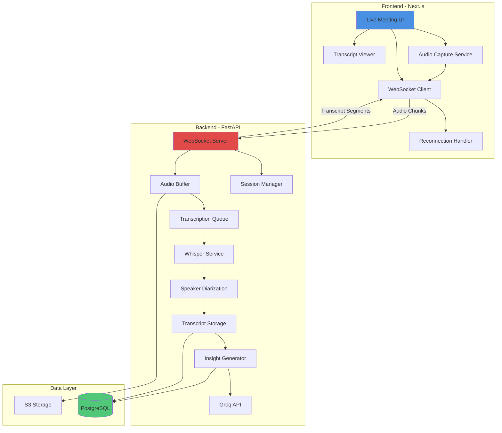
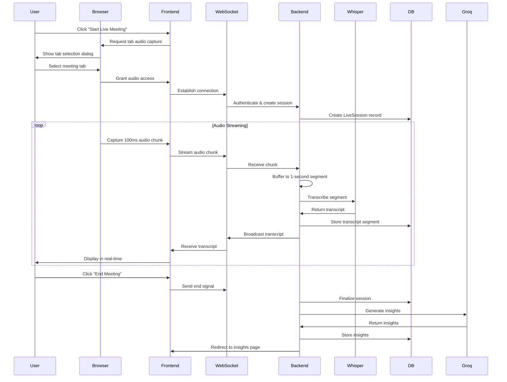
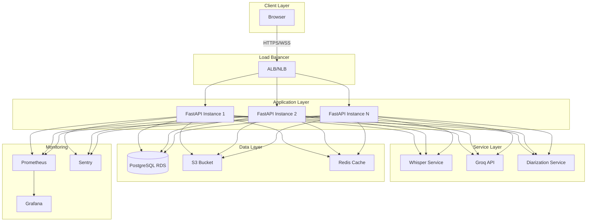

# Live Meeting Intelligence System - Design Document

## Overview

The Live Meeting Intelligence System extends the existing AI Meeting Intelligence Platform with real-time meeting capture capabilities. This design integrates WebSocket-based audio streaming, real-time transcription, speaker diarization, and AI-powered insights generation into the existing FastAPI/Next.js architecture.

### Design Goals

1. **Real-Time Performance**: Achieve <2 second latency from audio capture to transcript display
2. **Production Stability**: Support 2+ hour meetings without memory leaks or performance degradation
3. **Seamless Integration**: Reuse existing services (Whisper, LLM, Embedding) with minimal modifications
4. **Scalability**: Handle concurrent live sessions from multiple users
5. **Graceful Degradation**: Maintain core functionality during partial service failures

### Key Design Decisions

- **WebSocket Protocol**: Chosen for bidirectional real-time communication over HTTP polling
- **Chunked Audio Streaming**: 100ms frontend chunks → 1-second backend segments for optimal latency/accuracy tradeoff
- **Stateful Session Management**: LiveSession model tracks session state for reconnection and recovery
- **Groq API for Insights**: Fast inference (<30s) for real-time insight generation
- **Virtual Scrolling**: Maintain UI performance for long transcripts (2+ hours)
- **Browser Tab Audio**: Primary capture method for best quality without system-level permissions

## Architecture

### System Architecture Diagram



### Data Flow Diagram



### Component Integration

The live meeting system integrates with existing components:

**Reused Components:**
- `Meeting` model: Extended with `live_session` relationship
- `Transcript` model: Used for storing live transcript segments
- `Summary` model: Stores generated insights
- `WhisperService`: Adapted for streaming transcription
- `LLMService`: Used for insight generation via Groq
- `EmbeddingService`: Generates embeddings for semantic search
- User authentication and authorization

**New Components:**
- `LiveSession` model: Tracks session state
- `Speaker` model: Stores speaker information
- WebSocket server: Handles real-time communication
- Audio streaming pipeline: Captures and processes audio
- Live transcript UI: Real-time display component

## Components and Interfaces

### 1. Frontend Audio Capture Service

**Purpose**: Capture audio from browser tab and stream to backend

**Technology Stack**:
- Web Audio API for audio capture
- MediaRecorder API for encoding
- AudioContext for processing

**Interface**:
```typescript
interface AudioCaptureService {
  // Start capturing audio from selected tab
  startCapture(constraints: MediaStreamConstraints): Promise<MediaStream>
  
  // Stop audio capture
  stopCapture(): void
  
  // Get current audio level (for visualization)
  getAudioLevel(): number
  
  // Event handlers
  onAudioChunk(callback: (chunk: Blob) => void): void
  onError(callback: (error: Error) => void): void
}
```

**Implementation Details**:
- Capture audio at 16kHz sample rate (Whisper requirement)
- Encode as WebM/Opus for efficient streaming
- Chunk size: 100ms (1600 samples at 16kHz)
- Buffer up to 5 seconds during network issues
- Detect tab closure and notify user

**Audio Quality Settings**:
```typescript
const audioConstraints = {
  audio: {
    echoCancellation: true,
    noiseSuppression: true,
    autoGainControl: true,
    sampleRate: 16000,
    channelCount: 1
  }
}
```

### 2. WebSocket Client

**Purpose**: Bidirectional real-time communication with backend

**Technology Stack**:
- Native WebSocket API
- Reconnection logic with exponential backoff

**Interface**:
```typescript
interface WebSocketClient {
  // Connect to WebSocket server
  connect(sessionId: string, token: string): Promise<void>
  
  // Send audio chunk
  sendAudioChunk(chunk: Blob, metadata: AudioMetadata): void
  
  // Send control messages
  sendControl(action: 'pause' | 'resume' | 'end'): void
  
  // Receive transcript segments
  onTranscript(callback: (segment: TranscriptSegment) => void): void
  
  // Connection status
  onStatusChange(callback: (status: ConnectionStatus) => void): void
  
  // Disconnect
  disconnect(): void
}

interface AudioMetadata {
  timestamp: number
  sequenceNumber: number
  languageHint?: string
}

interface TranscriptSegment {
  id: number
  speaker: string
  text: string
  startTime: number
  endTime: number
  confidence: number
}

type ConnectionStatus = 'connecting' | 'connected' | 'reconnecting' | 'disconnected'
```

**Reconnection Strategy**:
- Initial retry: 1 second
- Max retry delay: 30 seconds
- Exponential backoff: delay *= 2
- Max retries: 10 attempts
- Preserve audio buffer during reconnection

### 3. Live Transcript Viewer Component

**Purpose**: Display real-time transcript with speaker identification

**Technology Stack**:
- React with TypeScript
- react-window for virtual scrolling
- Tailwind CSS for styling

**Interface**:
```typescript
interface LiveTranscriptViewerProps {
  segments: TranscriptSegment[]
  speakers: Speaker[]
  isLive: boolean
  connectionStatus: ConnectionStatus
  onSegmentClick?: (segment: TranscriptSegment) => void
}

interface Speaker {
  id: string
  name: string
  color: string
  talkTime: number
}
```

**Features**:
- Auto-scroll to latest segment (with manual override)
- Virtual scrolling for performance (2+ hour meetings)
- Speaker color coding
- Timestamp display
- Copy segment to clipboard
- Search within transcript
- Connection status indicator
- Meeting timer

**Performance Optimizations**:
- Virtual scrolling: Render only visible segments
- Memoization: Prevent unnecessary re-renders
- Debounced updates: Batch multiple segments
- Lazy loading: Load historical segments on demand

### 4. Backend WebSocket Server

**Purpose**: Handle WebSocket connections and audio streaming

**Technology Stack**:
- FastAPI WebSocket support
- asyncio for concurrent handling
- Redis for session state (optional, for multi-instance)

**Endpoint**:
```python
@router.websocket("/ws/live/{session_id}")
async def websocket_endpoint(
    websocket: WebSocket,
    session_id: str,
    token: str = Query(...),
    db: Session = Depends(get_db)
)
```

**Message Protocol**:
```python
# Client → Server
{
  "type": "audio_chunk",
  "data": "<base64_encoded_audio>",
  "metadata": {
    "timestamp": 1234567890,
    "sequence": 42,
    "language_hint": "en"
  }
}

{
  "type": "control",
  "action": "pause" | "resume" | "end"
}

# Server → Client
{
  "type": "transcript",
  "data": {
    "id": 123,
    "speaker": "Speaker 1",
    "text": "Hello world",
    "start_time": 10.5,
    "end_time": 12.3,
    "confidence": 0.95
  }
}

{
  "type": "status",
  "status": "processing" | "error" | "completed",
  "message": "Optional status message"
}
```

**Connection Management**:
- Authenticate user via JWT token
- Validate session_id exists and belongs to user
- Track active connections in memory
- Send ping/pong every 30 seconds
- Close stale connections after 60 seconds
- Preserve session state on disconnect

### 5. Audio Buffer and Segmentation

**Purpose**: Buffer audio chunks into segments for transcription

**Implementation**:
```python
class AudioBuffer:
    def __init__(self, segment_duration: float = 1.0):
        self.segment_duration = segment_duration
        self.buffer: List[bytes] = []
        self.buffer_duration: float = 0.0
    
    def add_chunk(self, chunk: bytes, duration: float) -> Optional[bytes]:
        """Add chunk to buffer, return segment if ready"""
        self.buffer.append(chunk)
        self.buffer_duration += duration
        
        if self.buffer_duration >= self.segment_duration:
            segment = b''.join(self.buffer)
            self.buffer.clear()
            self.buffer_duration = 0.0
            return segment
        
        return None
    
    def flush(self) -> Optional[bytes]:
        """Flush remaining buffer"""
        if self.buffer:
            segment = b''.join(self.buffer)
            self.buffer.clear()
            self.buffer_duration = 0.0
            return segment
        return None
```

**Buffering Strategy**:
- Frontend: 100ms chunks
- Backend: 1-second segments
- Tradeoff: Latency vs. transcription accuracy
- Whisper performs better with 1+ second audio

### 6. Live Transcription Service

**Purpose**: Adapt existing WhisperService for streaming transcription

**Modifications to WhisperService**:
```python
class WhisperService:
    # Existing method for file transcription
    def transcribe(self, audio_path: str) -> List[Dict]:
        ...
    
    # New method for streaming transcription
    async def transcribe_stream(
        self,
        audio_segment: bytes,
        language: Optional[str] = None
    ) -> Dict:
        """Transcribe audio segment for live streaming
        
        Args:
            audio_segment: Raw audio bytes (1-second segment)
            language: Optional language hint
            
        Returns:
            Single transcript segment with text and metadata
        """
        # Save segment to temp file
        temp_path = self._save_temp_segment(audio_segment)
        
        try:
            # Transcribe using Groq Whisper API
            result = await self._transcribe_groq_async(temp_path, language)
            return {
                "text": result.text,
                "confidence": getattr(result, 'confidence', 0.95),
                "language": getattr(result, 'language', language or 'en')
            }
        finally:
            # Clean up temp file
            os.remove(temp_path)
```

**Optimization for Streaming**:
- Use Groq's `whisper-large-v3-turbo` for speed
- Async processing to avoid blocking
- Temp file cleanup to prevent disk bloat
- Language hint to improve accuracy

### 7. Speaker Diarization Service

**Purpose**: Identify and track speakers throughout the meeting

**Technology Stack**:
- pyannote.audio for speaker diarization
- Speaker embedding comparison for tracking

**Interface**:
```python
class SpeakerDiarizationService:
    def __init__(self):
        # Initialize pyannote pipeline
        self.pipeline = Pipeline.from_pretrained(
            "pyannote/speaker-diarization-3.1"
        )
        self.speaker_embeddings: Dict[str, np.ndarray] = {}
    
    async def identify_speaker(
        self,
        audio_segment: bytes,
        session_id: str
    ) -> str:
        """Identify speaker in audio segment
        
        Returns:
            speaker_id: "Speaker 1", "Speaker 2", etc.
        """
        # Extract speaker embedding
        embedding = self._extract_embedding(audio_segment)
        
        # Compare with known speakers
        speaker_id = self._match_speaker(embedding, session_id)
        
        # Store embedding for future matching
        if speaker_id not in self.speaker_embeddings:
            self.speaker_embeddings[speaker_id] = embedding
        
        return speaker_id
    
    def _match_speaker(
        self,
        embedding: np.ndarray,
        session_id: str,
        threshold: float = 0.7
    ) -> str:
        """Match embedding to known speaker or create new"""
        for speaker_id, known_embedding in self.speaker_embeddings.items():
            similarity = cosine_similarity(embedding, known_embedding)
            if similarity > threshold:
                return speaker_id
        
        # New speaker
        speaker_num = len(self.speaker_embeddings) + 1
        return f"Speaker {speaker_num}"
```

**Diarization Strategy**:
- Extract speaker embedding from each segment
- Compare with known speakers using cosine similarity
- Threshold: 0.7 for speaker matching
- Create new speaker if no match found
- Allow user to rename speakers post-meeting

### 8. Live Session Manager

**Purpose**: Manage session state and lifecycle

**Implementation**:
```python
class LiveSessionManager:
    def __init__(self, db: Session):
        self.db = db
        self.active_sessions: Dict[str, LiveSessionState] = {}
    
    async def create_session(
        self,
        user_id: int,
        meeting_title: str
    ) -> LiveSession:
        """Create new live session"""
        # Create meeting record
        meeting = Meeting(
            user_id=user_id,
            title=meeting_title,
            status=MeetingStatus.PROCESSING,
            audio_url=""  # Will be set after session ends
        )
        self.db.add(meeting)
        self.db.commit()
        
        # Create live session
        session_token = secrets.token_urlsafe(32)
        live_session = LiveSession(
            meeting_id=meeting.id,
            session_token=session_token,
            status="ACTIVE",
            started_at=datetime.utcnow()
        )
        self.db.add(live_session)
        self.db.commit()
        
        # Track in memory
        self.active_sessions[session_token] = LiveSessionState(
            session_id=live_session.id,
            meeting_id=meeting.id,
            user_id=user_id,
            audio_buffer=AudioBuffer(),
            segment_count=0
        )
        
        return live_session
    
    async def end_session(self, session_token: str) -> Meeting:
        """End live session and finalize meeting"""
        state = self.active_sessions.get(session_token)
        if not state:
            raise ValueError("Session not found")
        
        # Update session status
        live_session = self.db.query(LiveSession).filter(
            LiveSession.session_token == session_token
        ).first()
        live_session.status = "ENDED"
        live_session.ended_at = datetime.utcnow()
        live_session.duration_seconds = (
            live_session.ended_at - live_session.started_at
        ).total_seconds()
        
        # Update meeting status
        meeting = self.db.query(Meeting).get(state.meeting_id)
        meeting.status = MeetingStatus.COMPLETED
        meeting.duration = live_session.duration_seconds
        
        self.db.commit()
        
        # Clean up memory
        del self.active_sessions[session_token]
        
        return meeting

@dataclass
class LiveSessionState:
    session_id: int
    meeting_id: int
    user_id: int
    audio_buffer: AudioBuffer
    segment_count: int
    last_activity: datetime = field(default_factory=datetime.utcnow)
```

### 9. AI Insights Generator

**Purpose**: Generate meeting insights using Groq API

**Integration with Existing LLMService**:
```python
class LLMService:
    # Existing methods...
    
    async def generate_live_insights(
        self,
        transcript_segments: List[Transcript],
        meeting_duration: float
    ) -> Dict:
        """Generate insights for live meeting
        
        Returns:
            Dict with summary, action_items, decisions, risks, next_steps
        """
        # Combine transcript segments
        full_transcript = self._format_transcript(transcript_segments)
        
        # Generate insights using Groq
        prompt = f"""Analyze this meeting transcript and provide:

1. Summary (2-3 paragraphs)
2. Key Discussion Points (bullet list)
3. Action Items (with owner if mentioned)
4. Decisions Made
5. Risks and Blockers
6. Next Steps

Transcript:
{full_transcript}

Duration: {meeting_duration / 60:.1f} minutes
"""
        
        response = await self.groq_client.chat.completions.create(
            model="llama-3.1-70b-versatile",
            messages=[{"role": "user", "content": prompt}],
            temperature=0.3,
            max_tokens=2000
        )
        
        # Parse structured response
        insights = self._parse_insights(response.choices[0].message.content)
        
        return insights
    
    def _format_transcript(self, segments: List[Transcript]) -> str:
        """Format transcript segments for LLM"""
        lines = []
        for seg in segments:
            timestamp = f"[{seg.start_time:.1f}s]"
            lines.append(f"{timestamp} {seg.speaker}: {seg.text}")
        return "\n".join(lines)
```

**Insight Generation Strategy**:
- Use Groq for fast inference (<30 seconds)
- Structured prompt for consistent output
- Parse response into database fields
- Fallback to simpler extraction if parsing fails

## Data Models

### Database Schema Extensions

**LiveSession Model** (already exists):
```python
class LiveSession(Base):
    __tablename__ = "live_sessions"
    
    id = Column(Integer, primary_key=True)
    meeting_id = Column(Integer, ForeignKey("meetings.id"))
    session_token = Column(String(255), unique=True, index=True)
    status = Column(String(50))  # ACTIVE, PAUSED, ENDED, ERROR
    started_at = Column(DateTime)
    ended_at = Column(DateTime, nullable=True)
    duration_seconds = Column(Float)
    error_message = Column(Text, nullable=True)
    
    # Relationships
    meeting = relationship("Meeting", back_populates="live_session")
```

**Speaker Model** (already exists):
```python
class Speaker(Base):
    __tablename__ = "speakers"
    
    id = Column(Integer, primary_key=True)
    meeting_id = Column(Integer, ForeignKey("meetings.id"))
    speaker_number = Column(Integer)  # 1, 2, 3, etc.
    speaker_name = Column(String(255), nullable=True)  # User-assigned name
    talk_time_seconds = Column(Float)
    word_count = Column(Integer)
    created_at = Column(DateTime)
    
    # Relationships
    meeting = relationship("Meeting", back_populates="speakers")
```

**Transcript Model Extensions**:
```python
# Add new fields to existing Transcript model
class Transcript(Base):
    # Existing fields...
    confidence = Column(Float, default=1.0)  # NEW: Transcription confidence
    language = Column(String(10), default='en')  # NEW: Detected language
    is_final = Column(Boolean, default=True)  # NEW: For streaming updates
```

**Summary Model Extensions**:
```python
# Add new fields to existing Summary model
class Summary(Base):
    # Existing fields...
    decisions = Column(JSON, nullable=True)  # NEW: Decisions made
    risks = Column(JSON, nullable=True)  # NEW: Risks and blockers
    next_steps = Column(JSON, nullable=True)  # NEW: Next steps
    topics = Column(JSON, nullable=True)  # NEW: Discussed topics
    meeting_analytics = Column(JSON, nullable=True)  # NEW: Analytics data
```

### API Endpoints

**Live Meeting Endpoints**:
```python
# Start live meeting
POST /api/v1/meetings/start-live
Query params: meeting_title
Response: {
  "meeting_id": 123,
  "session_token": "abc123...",
  "websocket_url": "ws://localhost:8000/ws/live/abc123"
}

# WebSocket connection
WS /ws/live/{session_token}
Query params: token (JWT)

# End live meeting
POST /api/v1/meetings/{meeting_id}/end
Query params: session_token
Response: {
  "meeting_id": 123,
  "status": "completed",
  "insights_ready": false
}

# Get live status
GET /api/v1/meetings/{meeting_id}/live-status
Query params: session_token
Response: {
  "status": "ACTIVE",
  "duration_seconds": 120.5,
  "segment_count": 120,
  "speakers": ["Speaker 1", "Speaker 2"]
}

# Pause/Resume (optional)
POST /api/v1/meetings/{meeting_id}/pause
POST /api/v1/meetings/{meeting_id}/resume
```

**Existing Endpoints (Reused)**:
- `GET /api/v1/meetings/{meeting_id}` - Get meeting details
- `GET /api/v1/meetings/{meeting_id}/transcripts` - Get transcript
- `GET /api/v1/meetings/{meeting_id}/summary` - Get insights
- `GET /api/v1/meetings/{meeting_id}/search` - Search transcript


## Correctness Properties

*A property is a characteristic or behavior that should hold true across all valid executions of a system—essentially, a formal statement about what the system should do. Properties serve as the bridge between human-readable specifications and machine-verifiable correctness guarantees.*

After analyzing the requirements, this feature has limited applicability for property-based testing. The Live Meeting Intelligence System is primarily:
- **Real-time infrastructure**: WebSocket connections, audio streaming, browser APIs
- **External service integration**: Whisper transcription, Groq LLM, speaker diarization
- **UI interactions**: Browser audio capture, real-time display, user controls
- **Performance requirements**: Latency, memory stability, long-running sessions

These characteristics make the system more suitable for **integration tests**, **example-based unit tests**, and **performance tests** rather than property-based testing.

However, there are a few core logic components where property-based testing adds value:

### Property 1: Audio Chunking Consistency

*For any* audio stream, when chunked into segments, all chunks SHALL be within the specified duration tolerance (100ms ± 10ms for frontend, 1000ms ± 50ms for backend)

**Validates: Requirements 3.2, 4.2**

### Property 2: Metadata Completeness

*For any* audio chunk sent to the backend, the chunk SHALL include all required metadata fields (session_id, timestamp, sequence_number)

**Validates: Requirements 3.3**

### Property 3: Reconnection Backoff Pattern

*For any* sequence of connection failures, the reconnection delay SHALL follow exponential backoff pattern (delay_n = min(initial_delay * 2^n, max_delay))

**Validates: Requirements 3.4**

### Property 4: Buffer Capacity Limit

*For any* sequence of audio chunks buffered during network instability, the total buffer duration SHALL NOT exceed 5 seconds

**Validates: Requirements 3.6**

### Property 5: Session Authentication Validation

*For any* incoming WebSocket connection, the backend SHALL validate both session_id existence and user authentication before accepting the connection

**Validates: Requirements 4.1**

### Property 6: Segment Buffering Accuracy

*For any* sequence of audio chunks received by the backend, when buffered into segments, each segment SHALL be 1 second ± 50ms in duration

**Validates: Requirements 4.2**

### Property 7: Session State Preservation

*For any* live session state (segment_count, speaker_list, metadata), when a connection is interrupted and reconnected, all state SHALL be preserved without loss

**Validates: Requirements 4.4**

### Property 8: Transcript Field Completeness

*For any* transcribed audio segment, the resulting transcript SHALL include all required fields (speaker, text, start_time, end_time, confidence)

**Validates: Requirements 5.3**

### Property 9: Confidence-Based Marking

*For any* transcript segment with confidence score below 70%, the segment SHALL be marked as uncertain

**Validates: Requirements 5.4**

### Property 10: Duplicate Segment Deduplication

*For any* set of transcript segments containing duplicates (same speaker, overlapping timestamps, similar text), the system SHALL merge duplicates and maintain only unique segments

**Validates: Requirements 5.8**

### Property 11: Language Confidence Decision

*For any* language detection result with confidence above 90%, the system SHALL proceed with that language without user confirmation

**Validates: Requirements 6.3**

### Property 12: Speaker ID Uniqueness

*For any* set of detected speakers in a meeting, all assigned speaker_ids SHALL be unique

**Validates: Requirements 8.1**

### Property 13: Speaker ID Consistency

*For any* speaker appearing multiple times in a meeting, the same speaker_id SHALL be maintained across all appearances

**Validates: Requirements 8.2**

### Property 14: Speaker Rename Propagation

*For any* speaker rename operation, all transcript segments associated with that speaker SHALL be updated with the new name

**Validates: Requirements 8.7**

### Property 15: Segment Count Accuracy

*For any* live session, the segment_count in the session record SHALL equal the number of transcript segments stored for that meeting

**Validates: Requirements 15.2**

### Property 16: Session Resume Continuity

*For any* interrupted live session that reconnects, the session SHALL resume from the last successfully processed segment without gaps or duplicates

**Validates: Requirements 15.4**

### Property 17: Session Data Persistence

*For any* completed live session, all associated data (transcripts, speakers, metadata) SHALL be retrievable from the database

**Validates: Requirements 15.7**

## Error Handling

### Error Categories and Recovery Strategies

**1. Audio Capture Errors**
- **Browser Permission Denied**: Display clear error message with instructions to grant permissions
- **Tab Closed/Switched**: Pause capture, show notification, allow resume when tab is reselected
- **Audio Device Unavailable**: Offer fallback capture methods (system loopback, microphone)
- **Recovery**: Automatic retry with user notification

**2. Network Errors**
- **WebSocket Connection Failed**: Exponential backoff reconnection (1s, 2s, 4s, ..., max 30s)
- **Connection Lost During Streaming**: Buffer audio locally (up to 5 seconds), resume on reconnection
- **Persistent Connection Failure**: Mark session as ERROR, preserve data, allow manual retry
- **Recovery**: Automatic reconnection with state preservation

**3. Transcription Errors**
- **Whisper API Failure**: Log error, mark segment as failed, continue with next segment
- **Timeout**: Retry once, then skip segment with warning
- **Invalid Audio Format**: Convert audio format, retry transcription
- **Recovery**: Graceful degradation, continue session

**4. Speaker Diarization Errors**
- **Diarization Service Unavailable**: Fall back to single speaker mode ("Speaker 1")
- **Low Confidence**: Allow user to manually assign speakers
- **Recovery**: Degrade to simpler speaker tracking

**5. Database Errors**
- **Connection Lost**: Queue writes in memory, retry on reconnection
- **Write Failure**: Log error, retry with exponential backoff
- **Constraint Violation**: Log error, skip problematic record
- **Recovery**: Retry with backoff, preserve data integrity

**6. Insight Generation Errors**
- **Groq API Failure**: Fall back to simpler extraction (keyword-based)
- **Timeout**: Retry once with shorter timeout
- **Invalid Response**: Parse what's available, mark as partial
- **Recovery**: Graceful degradation, allow manual regeneration

### Error Logging and Monitoring

All errors SHALL be logged with:
- Timestamp
- Error type and message
- Session ID and user ID
- Stack trace (for unexpected errors)
- Recovery action taken

Critical errors SHALL trigger alerts:
- Multiple consecutive transcription failures
- Database connection loss
- Memory threshold exceeded
- WebSocket connection pool exhausted

## Testing Strategy

### Testing Approach

The Live Meeting Intelligence System requires a **multi-layered testing strategy** combining:

1. **Property-Based Tests**: Core logic components (17 properties identified)
2. **Unit Tests**: Individual functions and classes
3. **Integration Tests**: External service interactions, WebSocket communication
4. **End-to-End Tests**: Complete user flows
5. **Performance Tests**: Latency, memory, long-running stability
6. **Manual Tests**: Browser compatibility, audio quality, UX

### Property-Based Testing

**Library**: `hypothesis` for Python, `fast-check` for TypeScript

**Configuration**:
- Minimum 100 iterations per property test
- Each test tagged with: `Feature: live-meeting-intelligence, Property {number}: {description}`

**Example Property Test**:
```python
from hypothesis import given, strategies as st
import pytest

@pytest.mark.property
def test_audio_chunking_consistency():
    """
    Feature: live-meeting-intelligence, Property 1: Audio Chunking Consistency
    For any audio stream, chunks shall be within duration tolerance
    """
    @given(
        audio_duration=st.floats(min_value=0.1, max_value=10.0),
        chunk_size_ms=st.integers(min_value=90, max_value=110)
    )
    def property_test(audio_duration, chunk_size_ms):
        # Generate mock audio stream
        audio_stream = generate_mock_audio(audio_duration)
        
        # Chunk the audio
        chunks = chunk_audio(audio_stream, target_size_ms=100)
        
        # Verify all chunks are within tolerance
        for chunk in chunks[:-1]:  # Exclude last chunk (may be partial)
            chunk_duration = get_chunk_duration(chunk)
            assert 90 <= chunk_duration <= 110, \
                f"Chunk duration {chunk_duration}ms outside tolerance [90, 110]"
    
    property_test()
```

### Unit Testing

**Focus Areas**:
- Audio buffer management
- Segment deduplication logic
- Speaker ID assignment
- Metadata validation
- Session state management

**Example Unit Test**:
```python
def test_audio_buffer_segments():
    """Test that audio buffer creates 1-second segments"""
    buffer = AudioBuffer(segment_duration=1.0)
    
    # Add 10 chunks of 100ms each
    for i in range(10):
        chunk = create_mock_chunk(duration_ms=100)
        segment = buffer.add_chunk(chunk, duration=0.1)
        
        if i < 9:
            assert segment is None, "Segment should not be ready yet"
        else:
            assert segment is not None, "Segment should be ready after 1 second"
            assert len(segment) > 0, "Segment should contain data"
```

### Integration Testing

**Focus Areas**:
- WebSocket connection and messaging
- Whisper API transcription
- Groq API insight generation
- Speaker diarization service
- Database operations
- Browser audio capture (with Playwright)

**Example Integration Test**:
```python
@pytest.mark.integration
async def test_websocket_audio_streaming():
    """Test complete audio streaming flow"""
    # Create test session
    session = await create_test_session()
    
    # Connect WebSocket
    async with websockets.connect(
        f"ws://localhost:8000/ws/live/{session.token}?token={jwt_token}"
    ) as ws:
        # Send audio chunks
        for i in range(10):
            chunk = create_mock_audio_chunk()
            await ws.send(json.dumps({
                "type": "audio_chunk",
                "data": base64.b64encode(chunk).decode(),
                "metadata": {
                    "timestamp": time.time(),
                    "sequence": i
                }
            }))
        
        # Receive transcript
        response = await ws.recv()
        data = json.loads(response)
        
        assert data["type"] == "transcript"
        assert "text" in data["data"]
        assert "speaker" in data["data"]
```

### End-to-End Testing

**Tool**: Playwright for browser automation

**Test Scenarios**:
1. Complete meeting flow: Start → Capture → Transcribe → End → View Insights
2. Pause and resume during meeting
3. Network interruption and reconnection
4. Multiple concurrent users
5. Long-running meeting (30+ minutes)

**Example E2E Test**:
```typescript
test('complete live meeting flow', async ({ page }) => {
  // Login
  await page.goto('/login')
  await page.fill('[name="email"]', 'test@example.com')
  await page.fill('[name="password"]', 'password')
  await page.click('button[type="submit"]')
  
  // Start live meeting
  await page.goto('/live-meeting')
  await page.fill('[name="title"]', 'Test Meeting')
  await page.click('button:has-text("Start Live Meeting")')
  
  // Grant audio permissions (mocked)
  await page.evaluate(() => {
    navigator.mediaDevices.getUserMedia = () => 
      Promise.resolve(new MediaStream())
  })
  
  // Wait for connection
  await page.waitForSelector('.connection-status:has-text("Connected")')
  
  // Verify transcript appears
  await page.waitForSelector('.transcript-segment', { timeout: 5000 })
  
  // End meeting
  await page.click('button:has-text("End Meeting")')
  await page.click('button:has-text("Confirm")')
  
  // Verify redirect to insights
  await page.waitForURL(/\/meeting\/\d+/)
  await page.waitForSelector('.summary-section')
})
```

### Performance Testing

**Focus Areas**:
- Transcription latency (<2 seconds)
- WebSocket message throughput
- Memory usage over time
- Long-running session stability (2+ hours)
- Concurrent user capacity

**Example Performance Test**:
```python
@pytest.mark.performance
async def test_transcription_latency():
    """Verify transcription latency is under 2 seconds"""
    latencies = []
    
    for i in range(100):
        # Create 1-second audio segment
        audio_segment = create_mock_audio_segment(duration=1.0)
        
        # Measure transcription time
        start_time = time.time()
        transcript = await whisper_service.transcribe_stream(audio_segment)
        latency = time.time() - start_time
        
        latencies.append(latency)
    
    # Verify 95th percentile is under 2 seconds
    p95_latency = np.percentile(latencies, 95)
    assert p95_latency < 2.0, f"P95 latency {p95_latency}s exceeds 2s threshold"
```

### Manual Testing Checklist

**Browser Compatibility**:
- [ ] Chrome (latest)
- [ ] Edge (latest)
- [ ] Firefox (latest)
- [ ] Safari (latest)

**Audio Quality**:
- [ ] Clear speech transcription
- [ ] Background noise handling
- [ ] Multiple speakers distinction
- [ ] Different accents and languages

**User Experience**:
- [ ] Smooth animations
- [ ] Responsive UI
- [ ] Clear error messages
- [ ] Intuitive controls

**Accessibility**:
- [ ] Keyboard navigation
- [ ] Screen reader compatibility
- [ ] Color contrast
- [ ] Text resizing

### Test Coverage Goals

- **Unit Tests**: 80%+ code coverage
- **Integration Tests**: All external service interactions
- **Property Tests**: All 17 identified properties
- **E2E Tests**: All critical user flows
- **Performance Tests**: All latency and stability requirements

### Continuous Integration

All tests SHALL run on:
- Every pull request
- Before deployment
- Nightly (including long-running tests)

**CI Pipeline**:
1. Lint and type checking
2. Unit tests (fast)
3. Property tests (100 iterations)
4. Integration tests (with mocked services)
5. E2E tests (critical flows only)
6. Performance tests (on staging)

## Technology Stack

### Frontend

**Core Framework**:
- Next.js 14+ (React 18+)
- TypeScript 5+
- Tailwind CSS 3+

**Audio Capture**:
- Web Audio API (native)
- MediaRecorder API (native)
- AudioContext for processing

**Real-Time Communication**:
- Native WebSocket API
- Reconnection logic: custom implementation

**UI Components**:
- react-window (virtual scrolling)
- Headless UI (accessible components)
- Framer Motion (animations)

**State Management**:
- React Context + useReducer
- Local state for UI
- WebSocket state in context

### Backend

**Core Framework**:
- FastAPI 0.104+
- Python 3.11+
- Uvicorn (ASGI server)

**WebSocket**:
- FastAPI WebSocket support
- asyncio for concurrent handling

**Audio Processing**:
- pydub (audio manipulation)
- ffmpeg (audio conversion)
- numpy (audio data processing)

**Transcription**:
- Groq API (Whisper large-v3-turbo)
- groq Python client

**Speaker Diarization**:
- pyannote.audio 3.1+
- torch (PyTorch for models)

**LLM Integration**:
- Groq API (llama-3.1-70b-versatile)
- groq Python client

**Database**:
- PostgreSQL 15+
- SQLAlchemy 2.0+ (ORM)
- Alembic (migrations)

**Storage**:
- AWS S3 (audio files)
- boto3 (S3 client)

**Task Queue** (optional for async processing):
- Celery 5+
- Redis (broker)

### Infrastructure

**Containerization**:
- Docker
- Docker Compose (development)

**Deployment**:
- AWS ECS or Kubernetes
- Load balancer for WebSocket connections
- Auto-scaling based on connection count

**Monitoring**:
- Prometheus (metrics)
- Grafana (dashboards)
- Sentry (error tracking)
- CloudWatch (AWS logs)

**CI/CD**:
- GitHub Actions
- Automated testing
- Staging deployment
- Production deployment

### Development Tools

**Testing**:
- pytest (Python)
- hypothesis (property testing)
- Playwright (E2E testing)
- Jest (TypeScript unit tests)
- fast-check (TypeScript property testing)

**Code Quality**:
- Black (Python formatting)
- Ruff (Python linting)
- mypy (Python type checking)
- ESLint (TypeScript linting)
- Prettier (TypeScript formatting)

**Documentation**:
- Swagger/OpenAPI (API docs)
- Mermaid (diagrams)
- Markdown (design docs)

## Deployment Architecture

### Production Deployment Diagram



### Scaling Considerations

**Horizontal Scaling**:
- Multiple FastAPI instances behind load balancer
- Sticky sessions for WebSocket connections
- Shared state via Redis (optional)

**Vertical Scaling**:
- Increase instance size for transcription workload
- GPU instances for speaker diarization (optional)

**Database Scaling**:
- Read replicas for analytics queries
- Connection pooling (SQLAlchemy)
- Partitioning for large transcript tables

**Storage Scaling**:
- S3 for unlimited audio storage
- CloudFront CDN for audio delivery
- Lifecycle policies for old recordings

### High Availability

**Redundancy**:
- Multi-AZ deployment
- Database failover
- Load balancer health checks

**Backup**:
- Automated database backups (daily)
- S3 versioning for audio files
- Point-in-time recovery

**Disaster Recovery**:
- Cross-region replication (optional)
- Backup restoration procedures
- Incident response plan

## Security Considerations

### Authentication and Authorization

**User Authentication**:
- JWT tokens for API access
- Token expiration: 24 hours
- Refresh token mechanism
- Secure token storage (httpOnly cookies)

**WebSocket Authentication**:
- JWT token in query parameter
- Validate on connection establishment
- Re-validate on reconnection

**Session Authorization**:
- Verify user owns the session
- Check session status before accepting audio
- Rate limiting per user

### Data Security

**Encryption in Transit**:
- TLS 1.3 for all HTTP/WebSocket connections
- WSS (WebSocket Secure) protocol
- Certificate management via AWS ACM

**Encryption at Rest**:
- S3 server-side encryption (AES-256)
- RDS encryption enabled
- Encrypted database backups

**Data Privacy**:
- Audio deleted after transcription (configurable retention)
- Transcript data encrypted in database
- User data isolation (row-level security)

### Input Validation

**Audio Chunk Validation**:
- Maximum chunk size: 1MB
- Valid audio format: WebM/Opus
- Metadata validation (session_id, timestamp)

**API Input Validation**:
- Pydantic models for request validation
- SQL injection prevention (parameterized queries)
- XSS prevention (output encoding)

### Rate Limiting

**WebSocket Connections**:
- Max 5 concurrent sessions per user
- Max 100 chunks per second per session
- Backpressure on excessive load

**API Endpoints**:
- 100 requests per minute per user
- 1000 requests per hour per user
- Exponential backoff on rate limit

### Monitoring and Auditing

**Audit Logging**:
- All session start/end events
- User authentication events
- Data access logs
- Error and security events

**Security Monitoring**:
- Failed authentication attempts
- Unusual traffic patterns
- Resource exhaustion attempts
- Unauthorized access attempts

## Performance Optimizations

### Frontend Optimizations

**Virtual Scrolling**:
- Render only visible transcript segments
- Lazy load historical segments
- Maintain scroll position on updates

**Debouncing and Throttling**:
- Batch transcript updates (100ms)
- Throttle scroll events (16ms)
- Debounce search input (300ms)

**Code Splitting**:
- Lazy load live meeting page
- Separate bundle for audio capture
- Dynamic imports for heavy components

**Memoization**:
- React.memo for transcript segments
- useMemo for expensive calculations
- useCallback for event handlers

### Backend Optimizations

**Async Processing**:
- Non-blocking WebSocket handlers
- Async transcription queue
- Concurrent segment processing

**Database Optimization**:
- Indexes on frequently queried fields
- Batch inserts for transcript segments
- Connection pooling (pool_size=20)

**Caching**:
- Redis cache for session state
- In-memory cache for speaker data
- CDN cache for static assets

**Resource Management**:
- Limit concurrent transcription jobs
- Memory-efficient audio buffering
- Periodic garbage collection

### Network Optimizations

**Compression**:
- Opus codec for audio (efficient)
- Gzip compression for WebSocket messages
- Brotli compression for HTTP responses

**Batching**:
- Batch transcript segments (up to 5)
- Reduce WebSocket message frequency
- Aggregate analytics updates

**Connection Management**:
- WebSocket connection pooling
- Keep-alive for HTTP connections
- Connection timeout tuning

## Migration and Rollout Strategy

### Phase 1: Infrastructure Setup (Week 1)

- Set up WebSocket server endpoint
- Configure load balancer for WebSocket
- Deploy speaker diarization service
- Set up monitoring and logging

### Phase 2: Core Functionality (Week 2-3)

- Implement audio capture frontend
- Implement WebSocket client
- Implement audio streaming backend
- Implement live transcription
- Basic speaker diarization

### Phase 3: UI and UX (Week 4)

- Build live transcript viewer
- Implement connection status indicators
- Add pause/resume controls
- Implement meeting timer
- Polish animations and transitions

### Phase 4: Insights and Analytics (Week 5)

- Integrate Groq API for insights
- Implement insight generation
- Build analytics dashboard
- Add semantic search

### Phase 5: Testing and Optimization (Week 6)

- Property-based testing
- Integration testing
- Performance testing
- Load testing
- Bug fixes and optimizations

### Phase 6: Beta Release (Week 7)

- Limited user beta
- Collect feedback
- Monitor performance
- Fix critical issues

### Phase 7: Production Release (Week 8)

- Full production deployment
- User documentation
- Support team training
- Marketing launch

### Rollback Plan

**Rollback Triggers**:
- Critical bugs affecting existing features
- Performance degradation
- Security vulnerabilities
- Data loss or corruption

**Rollback Procedure**:
1. Disable live meeting feature flag
2. Revert to previous deployment
3. Restore database from backup (if needed)
4. Notify users of temporary unavailability
5. Investigate and fix issues
6. Re-deploy with fixes

### Feature Flags

**Gradual Rollout**:
- Enable for internal users first
- Enable for 10% of users
- Enable for 50% of users
- Enable for all users

**Feature Toggles**:
- `LIVE_MEETING_ENABLED`: Master toggle
- `SPEAKER_DIARIZATION_ENABLED`: Speaker identification
- `GROQ_INSIGHTS_ENABLED`: AI insights generation
- `PREMIUM_FEATURES_ENABLED`: Premium features

## Future Enhancements

### Short-Term (3-6 months)

1. **Mobile App Support**: Native iOS/Android apps with live meeting capture
2. **Improved Speaker Diarization**: Better accuracy with speaker embeddings
3. **Real-Time Translation**: Live translation during meetings
4. **Meeting Templates**: Pre-configured settings for different meeting types
5. **Collaborative Notes**: Shared note-taking during live meetings

### Medium-Term (6-12 months)

1. **Video Capture**: Capture video alongside audio for richer context
2. **Screen Sharing Analysis**: OCR and analysis of shared screens
3. **Sentiment Analysis**: Real-time sentiment tracking during meetings
4. **Meeting Coaching**: AI-powered suggestions during meetings
5. **Integration Hub**: Zapier, Make.com integrations

### Long-Term (12+ months)

1. **AI Meeting Assistant**: Proactive AI participant in meetings
2. **Predictive Insights**: Predict meeting outcomes and risks
3. **Meeting Automation**: Automated follow-ups and task creation
4. **Enterprise Features**: SSO, SAML, advanced permissions
5. **White-Label Solution**: Customizable branding for enterprises

## Conclusion

The Live Meeting Intelligence System design provides a comprehensive, production-ready architecture for real-time meeting capture and analysis. Key design strengths:

1. **Scalable Architecture**: Supports concurrent users with horizontal scaling
2. **Robust Error Handling**: Graceful degradation and automatic recovery
3. **Performance Optimized**: <2 second latency, 2+ hour stability
4. **Security First**: End-to-end encryption, authentication, authorization
5. **Testable Design**: Property-based tests for core logic, comprehensive test strategy
6. **Extensible**: Clear interfaces for future enhancements

The design integrates seamlessly with the existing platform while introducing new real-time capabilities that transform the user experience. The phased rollout strategy ensures a smooth transition with minimal risk.
